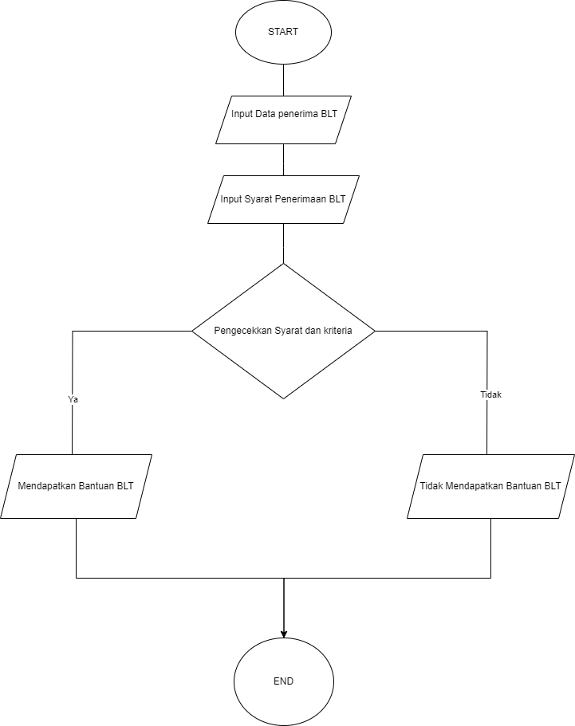

## PROGRAM PENERIMAAN BLT

# STUDI KASUS
Pemerintah sedang melaksanakan program bantuan langsung tunai BLT untuk warga yang memenuhi syarta tertentu. Untuk memudahkan proses pendaftaran dan seleksi, mereka mengembangkan sebuah sistem sederhana yang dapat menentukan kelayakan seseorang untuk menerima bantuan langsung tunai BLT berdasarkan  beberapah syarat.

# prgram harus memenuhi input berupa :
1.Nama
2.Nik
3.No handpone
4.Tempat tinggal

# Syarat kelengkapan 
1.Usia
2.Wni
3.Pekerjaan

# kriteria
1.pekerjaan yang tidak bisa mendapatkan BLT (pns,tni,polri,bumn,dokter)
2.Harus Wni
3.Usia harus lebih dari 50 tahun

jika warga memenuhi kriteria, maka program akan mencetak nama,nik,tempat tinggal,no handphone,pekerjaan dan hasil bahwa warga tersebut mendapatkan BLT, jika tidak program akan mencetak pesan yang sesuai.

## FLOWCHART

